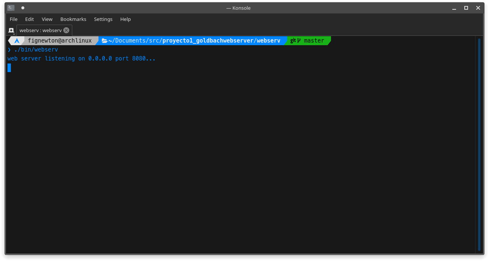
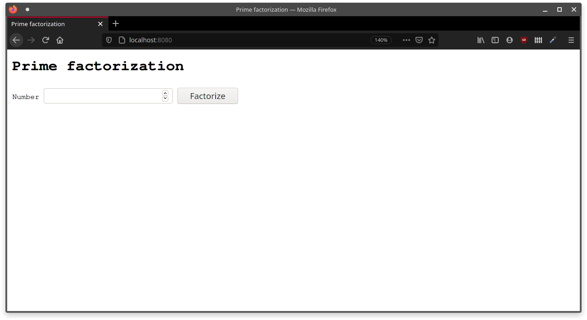
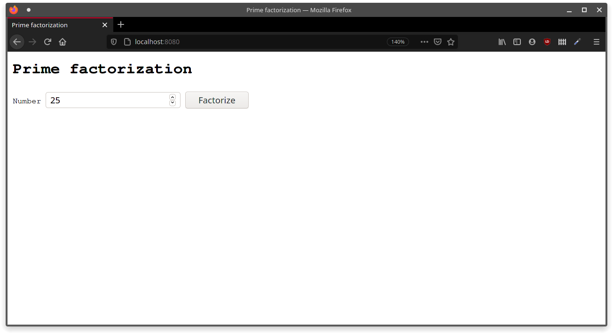
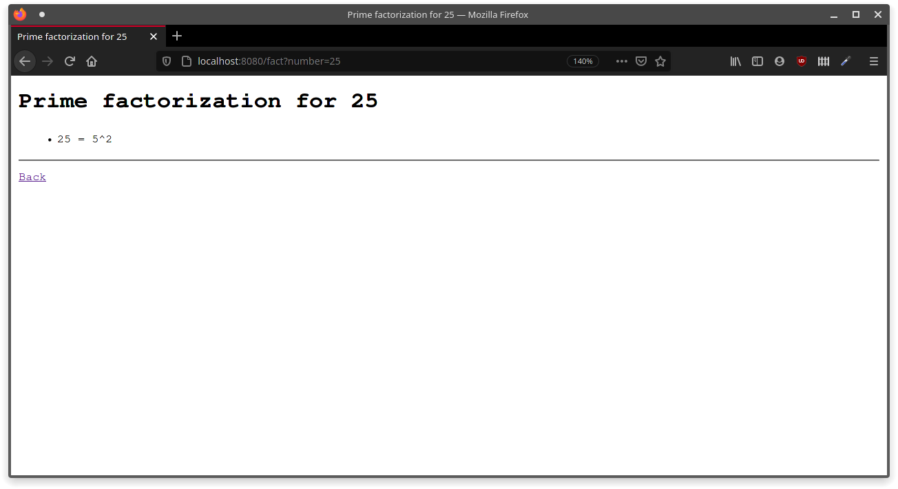
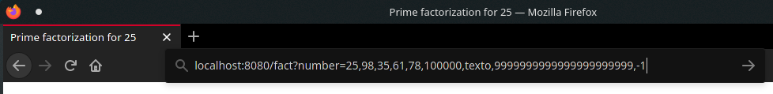
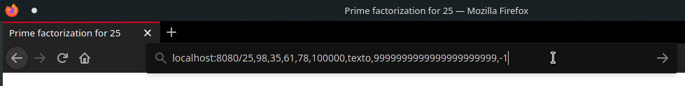
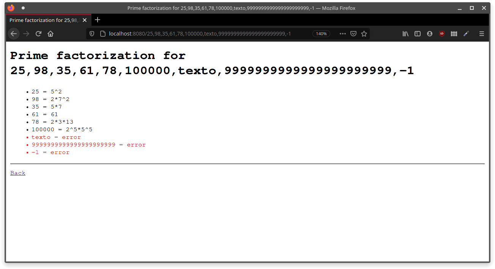
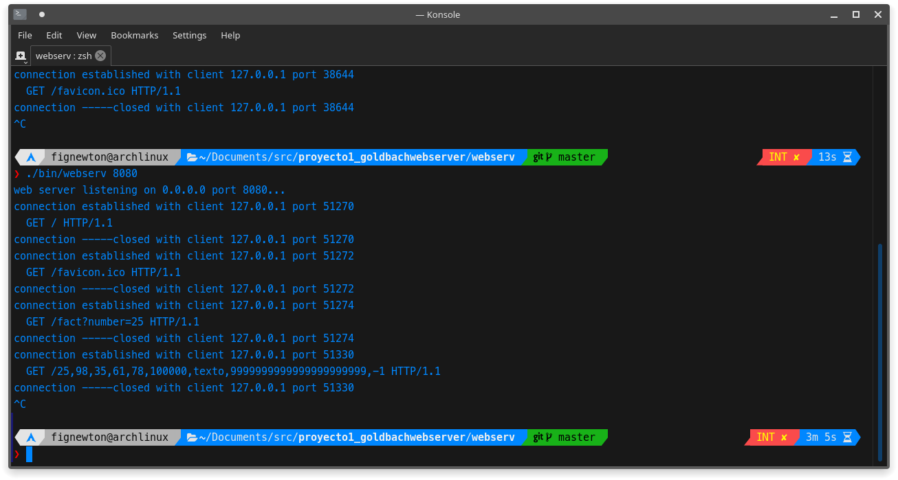
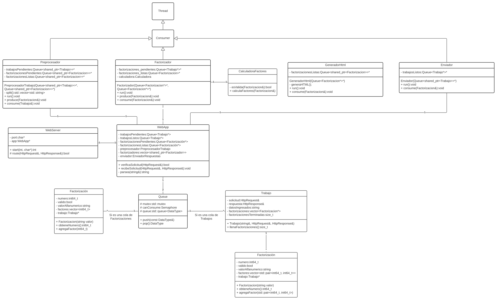
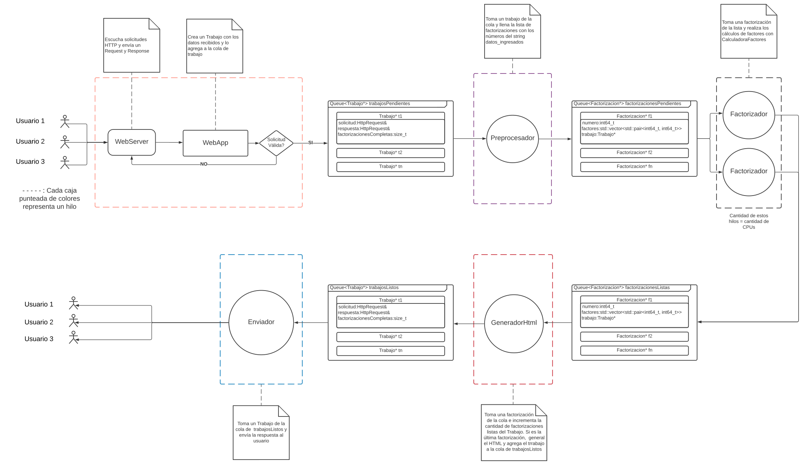

# Factorizacion Prima

#### Equipo:  Tronaditas
#### Integrantes: Frank Alvarado, Daniel Artavia, Pablo Otarola

## Factorización Prima
En este proyecto se implementa la factorización prima de un número, la cual corresponde a la representación de un número por medio de sus factores primos.

### Instrucciones de compilación (Build)
Para descargar y compilar el código, se deben ejecutar los siguientes comandos:

```bash
git clone https://git.ucr.ac.cr/ci0117-2020iii_tronaditas/proyecto1_factorizacionprimawebserver.git
cd proyecto1_factorizacionprimawebserver
cd webserv
make
```

### Manual de usuario
Una vez compilado el código, se debe cambiar/mover al directorio _proyecto1_factorizacionprimawebserver/webserv_
```bash
cd proyecto1_factorizacionprimawebserver/webserv
```

Dentro del directorio _proyecto1_factorizacionprimawebserver/webserv, se debe ejecutar el siguiente comando
```bash
./bin/webserv
```

El programa intentará usar el puerto 8080 para escuchar por consultas HTTP. Si el puerto está ocupado, puede ingresar un número de puerto por argumento:
```bash
./bin/webserv 8081
```

Para este ejemplo, se usará el puerto 8080



Posteriormente, para abrir la interfaz del programa, debe abrir algún navegador web y dirigirse a http://localhost:8080 NOTA: es importante que use http:// y que agregue :8080 al final, ya que algunos navegadores, como Firefox, buscan, por defecto, crear una conexión HTTPS, y no va a poder abrir la interfaz de la aplicación.

Una vez en la dirección del programa, verá la siguiente interfaz:



La interfaz ofrece un campo de entrada de números en el que usted puede ingresar el número al cual desea factorizar:



El navegador mostrará en pantalla los resultados de la factorización



Adicionalmente, puede editar la URL en la barra de direcciones del navegador e ingresar una lista de valores separados por coma, de cualquiera de las siguientes maneras:




La aplicación calculará la factorización para cada uno de los elementos de la lista, si es posible. Si alguna de las entradas no es válida, mostrará un mensaje de error. Por ejemplo, para la lista de las imágenes anteriores, se obtiene el siguiente resultado:



Finalmente, para terminar la aplicación, dirijase a la terminal en la que se encuentra corriendo el servidor y presione la combinación de teclas Ctrl+C




## Diseño de la implementación concurrente:
El siguiente es un diagrama que muestra cómo se piensa implementar una versión concurrente de este programa:



